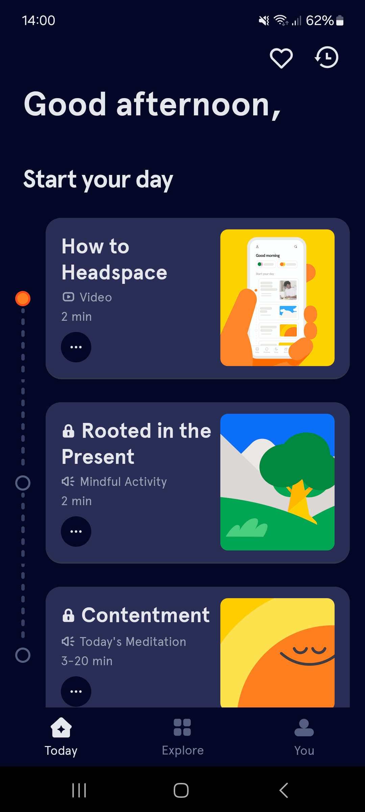

# Existing Apps

-   [Existing Apps](#existing-apps)
    -   [Headspace](#headspace)
        -   [Color Scheme:](#color-scheme)
        -   [User Interface:](#user-interface)
        -   [Illustrations:](#illustrations)
        -   [Overall Design:](#overall-design)
    -   [Calm](#calm)
        -   [Color Scheme:](#color-scheme-1)
        -   [User Interface:](#user-interface-1)
        -   [Illustrations:](#illustrations-1)
        -   [Overall Design:](#overall-design-1)
    -   [Endel](#endel)
        -   [Color Scheme:](#color-scheme-2)
        -   [User Interface:](#user-interface-2)
        -   [Soundscapes:](#soundscapes)
        -   [Overall Design:](#overall-design-2)

## Headspace

Headspace is a popular mobile app focused on meditation, sleep, mindfulness, and mental health.

### Color Scheme:

Headspace employs a calming and soothing color palette, typically featuring soft colors like light blues, oranges, and yellows. These colors are chosen intentionally to evoke feelings of relaxation and aligning with the app's core mission of promoting mental wellness.

### User Interface:

Headspace boasts a user-friendly interface designed to guide users seamlessly through various meditation exercises and mindfulness practices. The interface is intuitive and streamlined, allowing users to navigate the app effortlessly. Clear and concise menus, along with well-defined sections, help users find what they need quickly and efficiently.

### Illustrations:

One of the distinctive features of Headspace is its delightful illustrations. These chidish illustrations are used throughout the app, accompanying meditation sessions, educational content, and progress tracking. They serve to add warmth, personality, and a touch of playfulness to the user experience, making the journey towards mindfulness more engaging and enjoyable.

### Overall Design:

In terms of overall design, Headspace prioritizes simplicity, accessibility, and visual appeal. The app's layout is thoughtfully structured to facilitate a seamless user experience. From the smooth color scheme to the user-friendly interface and chidish illustrations, every aspect of Headspace's design is crafted with the user's well-being and comfort in mind. Overall, Headspace succeeds in creating a calming digital enveremnt where users can find moments of peace in their busy lives.

## Calm

Calm is a widely-used mobile app that offers a variety of resources to support relaxation, meditation, and better sleep.

### Color Scheme:

Similar to Headspace, Calm employs a smooth color palette characterized by soft tones such as pastel blues, greens, and purples. These colors are chosen to create a sense of calmness, aligning with the app's focus on promoting mental well-being and relaxation.

### User Interface:

Calm features a user-friendly interface designed to facilitate a seamless and intuitive user experience. The app's layout is organized logically, with easy-to-navigate menus and sections for different types of content, including guided meditations, sleep stories, and breathing exercises. The interface prioritizes clarity and simplicity, allowing users to access the resources they need with minimal effort.

### Illustrations:

Calm incorporates visually appealing illustrations that complement its content and enhance the overall user experience. These illustrations range from serene nature scenes to abstract artwork, reflecting the app's focus on promoting relaxation and mindfulness. Whether accompanying meditation sessions or sleep stories, the illustrations in Calm contribute to creating a visually engaging and immersive environment for users.

### Overall Design:

In terms of design, Calm excels in creating a serene and inviting digital space for users to unwind and destress. From its calming color scheme and elegant typography to its user-friendly interface and captivating illustrations, every aspect of the app's design is crafted with the user's well-being in mind. Calm's thoughtful design elements work together harmoniously to create a holistic and immersive experience that supports mental wellness and relaxation.

## Endel

Endel is an innovative mobile app that generates personalized soundscapes to help users focus, relax, and sleep better.

### Color Scheme:

Endel often utilizes a minimalist color palette characterized by neutral tones such as white, gray, and black. The app's design focuses on simplicity, with clean lines and minimalistic visual elements contributing to a modern and uncluttered aesthetic.

### User Interface:

Endel features a sleek and intuitive user interface designed to provide a seamless and immersive experience for users. The app's interface is streamlined and uncluttered, with intuitive navigation and well-defined sections for different functions. Users can easily customize their soundscapes, adjust settings, and explore various features without encountering any complexity or confusion.

### Soundscapes:

One of Endel's key features is its personalized soundscapes, which are dynamically generated based on factors such as time of day, location, and user preferences. These soundscapes are designed to promote relaxation, focus, or sleep, depending on the user's needs. Endel's soundscapes incorporate soothing sounds from nature, ambient music, and white noise, creating a calming and immersive auditory experience.

### Overall Design:

Endel's design focuses on simplicity, sophistication, and user-centricity. The app's minimalistic look, easy-to-use interface, and personalized soundscapes offer users a captivating experience for relaxation, focus, or improved sleep. With thoughtful design, Endel helps users achieve mental wellness goals and find calmness in daily life.

